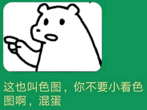

# 随机色图

该 API 最初是作为 [cq-picsearcher-bot](https://github.com/Tsuk1ko/cq-picsearcher-bot) 的娱乐功能而被开发出来的，后经过一些调整决定正式开放使用

> 目前已将 API 迁移出我个人的服务器并转用某些白嫖服务，因此我将限制放开了，不再需要 apikey 并且一次允许返回的数量增加了，但这也意味着可能存在一些来自服务商的隐性限制
>
> 如果服务因超出限制而宕掉，我不对此负责，**请理性使用**

## 前言

1. 所有图片均来自 [Pixiv](https://www.pixiv.net/)，版权也归作品的作者所有，API 仅储存了作品的基本信息，不提供图片的代理或储存服务
2. 为了保证质量，库中的图片全是由本人凭着性趣亲手添加的，不存在自动爬取等敷衍的操作，所以大部分图片都只是符合我个人的 xp 或是我喜爱的画风，如果你不喜欢那真是抱歉了
3. 我的 xp 是什么？看看这域名还不明白吗（
4. 这些色图是广义上的色图——任何能让**我好了**的图都可能被我算作色图，所以你也许会觉得并不是所有的图都很色，这是正常的，你就当成是抽卡好了，没必要拿去和其它色图库比较  
   
5. 不接受任何索要数据库的请求（反正会有一堆人来爬的，去找他们要）
6. 使用本 API 是你个人的行为，产生的任何问题都与我无关
7. 请**节制**，冲太多对身体不好
   <br>

## 最近一小时可用性

炸了就说明有憨批搁那拿爬虫CC

<iframe src="setu/availability.html" height="200" scrolling="no" style="border:none;margin:0"></iframe>

## Telegram Bot

[@setu_robot](https://t.me/setu_robot)，仅支持 inline 方式调用

## API v2

```http
GET https://api.lolicon.app/setu/v2
```

或

```http
POST https://api.lolicon.app/setu/v2
Content-Type: application/json
```

### 请求

| 参数名       |  数据类型  |     默认值     | 说明                                                                                                          |
| ------------ | :--------: | :------------: | ------------------------------------------------------------------------------------------------------------- |
| `r18`        |   `int`    |      `0`       | `0`为非 R18，`1`为 R18，`2`为混合（在库中的分类，不等同于作品本身的 R18 标识）                                |
| `num`        |   `int`    |      `1`       | 一次返回的结果数量，范围为`1`到`100`；在指定关键字或标签的情况下，结果数量可能会不足指定的数量                |
| `uid`        |  `int[]`   |                | 返回指定`uid`作者的作品，最多`20`个                                                                           |
| `keyword`    |  `string`  |                | 返回从标题、作者、标签中按指定关键字模糊匹配的结果，大小写不敏感，性能和准度较差且功能单一，建议使用`tag`代替 |
| `tag`        | `string[]` |                | 返回匹配指定标签的作品，[详见下文](#tag)                                                                      |
| `size`       | `string[]` | `["original"]` | 返回指定图片规格的地址，[详见下文](#size)                                                                     |
| `proxy`      |  `string`  | `i.pixiv.cat`  | 设置图片地址所使用的在线反代服务，[详见下文](#proxy)                                                          |
| `dateAfter`  |   `int`    |                | 返回在这个时间及以后上传的作品；时间戳，单位为毫秒                                                            |
| `dateBefore` |   `int`    |                | 返回在这个时间及以前上传的作品；时间戳，单位为毫秒                                                            |
| `dsc`        | `boolean`  |    `false`     | 设置为任意真值以禁用对某些缩写`keyword`和`tag`的自动转换，[详见下文](#dsc)                                    |

#### 关于数组形式的参数

GET 请求可以通过追加同名参数来发送数组，例如

```http
GET https://api.lolicon.app/setu/v2?size=original&size=regular
```

在 POST 请求中，如果数组内仅有一个项，可以将数组省略，例如`{ "size": ["regular"] }`和`{ "size": "regular" }`是等价的

#### `tag`

可以自由按照 AND 和 OR 规则来匹配标签、作者名、标题，所有匹配均大小写不敏感

其中标签和作者名使用 n-gram (2≤n≤3) 分词匹配，标题为完全匹配

参数数组内的每个字符串之间应用 AND 规则（最多`3`个）；每个字符串可以是若干个由`|`分隔的标签，它们之间应用 OR 规则（最多`20`个）

举个例子，我需要查找“(**萝莉**或**少女**)的(**白丝**或**黑丝**)的色图”，即 (**萝莉** OR **少女**) AND (**白丝** OR **黑丝**)，那么可以这样发送请求

```http
GET https://api.lolicon.app/setu/v2?tag=萝莉|少女&tag=白丝|黑丝
```

```http
POST https://api.lolicon.app/setu/v2
Content-Type: application/json

{
  "tag": [
    "萝莉|少女",
    "白丝|黑丝"
  ]
}
```

特别地，对于 POST 请求，你可以直接发送二维数组，不需要特地使用`|`拼接

```http
POST https://api.lolicon.app/setu/v2
Content-Type: application/json

{
  "tag": [
    ["萝莉", "少女"],
    ["白丝", "黑丝"],
  ]
}
```

#### `size`

以下为五种规格的示例（SFW，请放心打开）

| 规格       | 地址                                                                                              |
| ---------- | ------------------------------------------------------------------------------------------------- |
| `original` | https://i.pixiv.cat/img-original/img/2021/06/14/17/25/59/90551655_p0.jpg                          |
| `regular`  | https://i.pixiv.cat/img-master/img/2021/06/14/17/25/59/90551655_p0_master1200.jpg                 |
| `small`    | https://i.pixiv.cat/c/540x540_70/img-master/img/2021/06/14/17/25/59/90551655_p0_master1200.jpg    |
| `thumb`    | https://i.pixiv.cat/c/250x250_80_a2/img-master/img/2021/06/14/17/25/59/90551655_p0_square1200.jpg |
| `mini`     | https://i.pixiv.cat/c/48x48/img-master/img/2021/06/14/17/25/59/90551655_p0_square1200.jpg         |

你可能发现了，`small`,`thumb`,`mini`这些规格的地址中的参数其实是可调的而非定死的，因此如果你有需求，可以造出一个特定大小的缩略图，详见下面的`proxy`说明

若`size`参数不符合上面任何一个规格，最终返回的`urls`将为一个空对象`{}`

#### `proxy`

由于P站资源域名`i.pximg.net`具有防盗链措施，不含`www.pixiv.net` referer 的请求均会 403，所以如果需要直接在网页上展示或在客户端上直接下载必须依靠反代服务

1. 你可以设置为任何假值(`""`,`0`,`false`,`null`)来得到原始的 i.pximg.net 图片地址
1. 当不指定协议时，会自动补充`https://`
1. 可使用以下占位符
| 占位符         | 说明                  | 实际值（以 90551655_p0 为例） |
| -------------- | --------------------- | ----------------------------- |
| `{{pid}}`      | 作品 pid              | 90551655                      |
| `{{p}}`        | 作品所在页            | 0                             |
| `{{uid}}`      | 作者 uid              | 43454954                      |
| `{{ext}}`      | 图片扩展名 (original) | jpg                           |
| `{{path}}`     | 图片地址的相对路径    | 根据规格不同而不同            |
| `{{datePath}}` | 相对路径中的日期部分  | 2021/06/14/17/25/59           |

例：以下四种是等价的

```
i.pixiv.cat
https://i.pixiv.cat
i.pixiv.cat/{{path}}
https://i.pixiv.cat/{{path}}
```

若你使用了占位符，但没有用到`{{path}}`，则`size`参数是无意义的，不管什么规格返回的地址都将相同

##### 利用占位符自定义缩略图规格

上面说到可以造特定大小的缩略图，格式大概是这样

```
https://i.pixiv.cat/c/<size>x<size>/img-master/img/{{datePath}}/{{pid}}_p{{p}}_<master|square>1200.jpg
```

- `<size>x<size>`这里长宽必须相同，最大为`600x600`，某些特定的大小会需要加上固定的图片质量参数，就像`small`和`thumb`
- `<master|square>`控制裁切方式，`master`是等比例缩放（不裁切）使长度或宽度最大为`<size>`，`square`是居中裁切

#### `dsc`

API 内部包含极少量规则，会对某些`keyword`和`tag`进行转换，使某些不适合搜索的词变得可以按预期进行搜索，它们通常是一些手游或者人物的缩写或简称，例如

```
vtb => 虚拟YouTuber|VTuber
fgo => Fate/GrandOrder|Fate/Grand Order|FateGrandOrder
pcr => 公主连结|公主连结Re:Dive|プリンセスコネクト
gbf => 碧蓝幻想
舰b => 碧蓝航线|AzurLane
舰c => 舰队collection
少前 => 少女前线|girlsfrontline
```

将`dsc`设置为任意真值可以禁用这些转换

### 响应

| 字段名  | 数据类型 | 说明     |
| ------- | :------: | -------- |
| `error` | `string` | 错误信息 |
| `data`  | `setu[]` | 色图数组 |

#### `setu`

| 字段名       |  数据类型  | 说明                                                  |
| ------------ | :--------: | ----------------------------------------------------- |
| `pid`        |   `int`    | 作品 pid                                              |
| `p`          |   `int`    | 作品所在页                                            |
| `uid`        |   `int`    | 作者 uid                                              |
| `title`      |  `string`  | 作品标题                                              |
| `author`     |  `string`  | 作者名（入库时，并过滤掉 @ 及其后内容）               |
| `r18`        | `boolean`  | 是否 R18（在库中的分类，不等同于作品本身的 R18 标识） |
| `width`      |   `int`    | 原图宽度 px                                           |
| `height`     |   `int`    | 原图高度 px                                           |
| `tags`       | `string[]` | 作品标签，包含标签的中文翻译（有的话）                |
| `ext`        |  `string`  | 图片扩展名                                            |
| `uploadDate` |   `int`    | 作品上传日期；时间戳，单位为毫秒                      |
| `urls`       |  `object`  | 包含了所有指定`size`的图片地址                        |

## 其它细节

- **自动更新作品信息**  
  被获取的作品如果距离上次更新信息超过一个月，则会被加入更新队列在后台进行信息更新，以防止作品修改或删除造成的原图地址失效。但当次调用以及直到信息更新完毕前，从 API 获取到的信息仍会是旧的信息。

## 旧版 API 文档

- [v1](setu-v1)

## 目前可以透露的情报

<div class="chartboard pure-g">
  <div class="pure-u-1 pure-u-sm-1-2">
    <div class="pure-g">
      <div class="pure-u-1">
        <div class="chart h-50">
          <iframe class="lazyload" data-src="https://charts.mongodb.com/charts-setu-api-qxdzw/embed/charts?id=f973f61b-912b-4dd6-b00a-f9c52db92918&attribution=false"></iframe>
        </div>
      </div>
      <div class="pure-u-1">
        <div class="chart h-50">
          <iframe class="lazyload" data-src="https://charts.mongodb.com/charts-setu-api-qxdzw/embed/charts?id=b23a40a5-8c50-48ae-a950-95c81f9b013c&attribution=false"></iframe>
        </div>
      </div>
    </div>
  </div>
  <div class="pure-u-1 pure-u-sm-1-2">
    <div class="chart h-100">
      <iframe class="lazyload" data-src="https://charts.mongodb.com/charts-setu-api-qxdzw/embed/charts?id=d44725c5-3392-4851-9053-4232ccad8bd9&attribution=false"></iframe>
    </div>
  </div>
</div>
